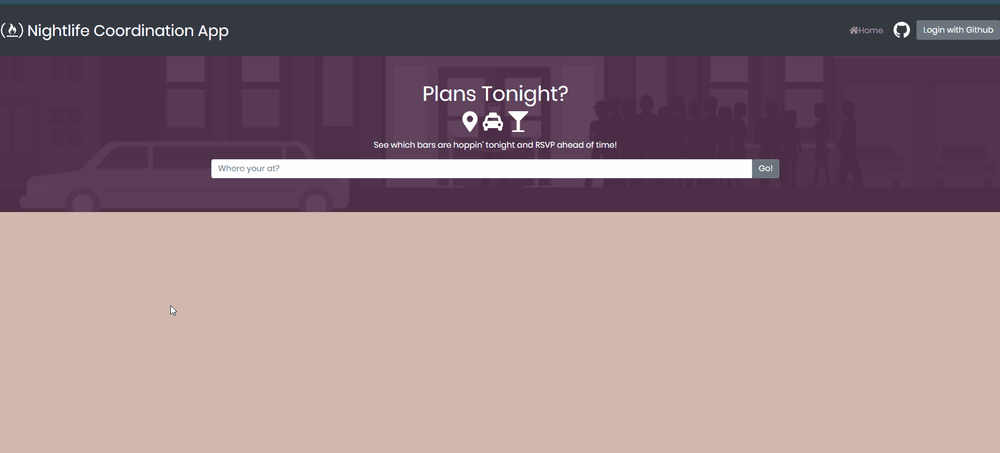

# Nightlife Coordination App with NodeJS.

In this App you can view any bar or restaurant in any area searched. Also you can login in and indicate you are going there or cancel the reservation.

Is made with NodeJS, MongoDB, EJS templates and powered by Yelp.com.



You can see this alive, [Click here](https://secret-fjord-49592.herokuapp.com/).

This Project is part of the Freecodecamp course.

## Getting Started

Click in the download button and get the .zip file. Extract the contents of the zip file.

Or can clone this repository, just copy the git url and open your terminal and run git clone + repository url:

```
git clone https://github.com/ejgdev/Nightlife-Coordination-App.git
```

### Prerequisites

It is necessary to have installed a package manager like npm or yarn.

- [NodeJS website](https://nodejs.org/).
- [Yarn website](https://yarnpkg.com/).

### Enviroment Keys configuration
#### Github OAuth Token keywords:
You need login in your Github account and enter this [link](https://github.com/settings/developers). Then create `New OAuth App`:

If you want run this Project in local, you can use this configuration:
- Application name: Any name you want.
- Homepage URL: http://localhost:8080/
- Authorization callback URL: http://localhost:8080/auth/github/callback

Then you can copy the **Client ID** as your `GITHUB_KEY` and your **Client Secret** as yor `GITHUB_SECRET` in your `.env file`.

#### MongoDB configuration
You Need an account in [mlab](https://mlab.com/), then create a database with two collections: `places` and `users` like the App's models.

Then in your `.env file` copy the MongoDB URI:
- `mongodb://<dbuser>:<dbpassword>@ds<deploymentnumber>.mlab.com:<id>/mydb`

Note: In your mLab database website shows your URI link.

#### Yelp configuration
You Need an account in [Yelp.com](https://www.yelp.com/), then go to this [Link](https://www.yelp.com/fusion) and click `create App`.

- Get your API Key from the Manage App page and paste in your `.env file`.

#### App  configuration
Only left two more configuration.
- one of them is the `PORT`, you can use your own port or by default is `8080`.
- The last one is the `APP_URL`, you can use your own url website or `http://localhost:8080/`.

You can see the `.env.example` file for references.

### Installing

For install this repository, just need to run this command:

```
npm install
```

### Start the Project
When everything is setup, you can run the project with this command:

```
npm run start:dev
```
Then open http://localhost:8080/ to see your app. By default run on port 8080.

## Deployment

There are differents way to Deployment.

If you want use Heroku, you can follow this [article](https://devcenter.heroku.com/articles/git).

When your heroku app is created, just need deploy with this command:

```
git push heroku master
```
## Freecodecamp Information

### Objective:
Build a full stack JavaScript app that is functionally similar to **[this page](https://yasser-nightlife-app.herokuapp.com/)** and deploy it to Heroku.

Note that for each project, you should create a new GitHub repository and a new Heroku project. If you can't remember how to do this, revisit [This Page](https://freecodecamp.org/challenges/get-set-for-our-dynamic-web-application-projects).

Here are the specific user stories you should implement for this project:

### User Story:
>1. As an unauthenticated user, I can view all bars in my area.

>2. As an authenticated user, I can add myself to a bar to indicate I am going there tonight.

>3. As an authenticated user, I can remove myself from a bar if I no longer want to go there.

>4. As an unauthenticated user, when I login I should not have to search again.


### Hint:
Try using the **[Yelp API](https://www.yelp.com/developers/documentation/v2/overview)** to find venues in the cities your users search for. If you use Yelp's API, be sure to mention so in your app

#### Links
[Demo App](https://secret-fjord-49592.herokuapp.com/)

[Github](https://github.com/ejgdev/Nightlife-Coordination-App)
